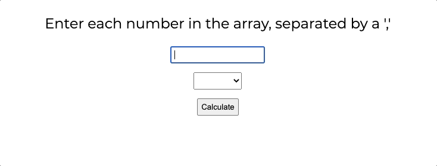

# React Forms Lab

Using React, build a form that will dynamically take in text and perform a mathematical operation on it.


---

## Lab Setup

### Getting started

1. Fork and clone this repository.

1. Navigate to the cloned repository's directory on your command line. Then, run the following command:

   ```
   npm install
   ```

   This will install the libraries needed to run the tests.

1. Open up the repository in VSCode. Follow the instructions below to complete the Lab.

### Tests

To run the tests, you can run the following command from the command line. You will need to be in the root directory of your local directory.

```
npm test
```

This will open the Cypress testing window, where you can click to run an individual suite of tests or all of the tests at once.

#### Testing Tips

Keep the following in mind for this lab as you run the tests.

1. While running your tests, you must have a server up and running in another terminal. This means you will have _both_ a terminal window running the actual React application _and_ a terminal window running the tests.

1. When creating a component, make sure to create and import it with the same name as the file name. For example, the component created and exported inside of the `Post.js` file should be `Post`. The tests look for these specific names.

1. While the `cypress-watch-and-reload` package has been installed in this project, sometimes the React application will take longer to reload than the tests. If you feel as though a test should be passing that isn't, try pressing the re-run button in the Cypress tests before asking for help.

## Instructions

Build a React app containing:

- An input where the user can enter comma-separated number values in an array.
- A select input to choose between calculating the sum, the average, and the [mode](https://www.mathsisfun.com/definitions/mode.html) -- the most frequently occurring number.
- A "Calculate" button that, when pressed, puts the result of the selected operation on the input numbers on the screen.
  - If the numbers are invalid for some reason, display the exact message `Invalid input.`, keeping the punctuation.

You should leave the component structure as is.

### Examples

For example, if the text input contains `1,3,3,7` and the select is set to `sum`, clicking the button should print `14` to the screen.
Switching the select to `mode` and clicking the button again would replace that with `3`.

| input | operation | result         |
| ----- | --------- | -------------- |
| 1     | average   | 1              |
| 1     | mode      | 1              |
| 1     | sum       | 1              |
| 1,3,5 | average   | 3              |
| 1,3,5 | mode      | 1              |
| 1,3,5 | sum       | 9              |
|       | \*        | Invalid input. |
| apple | \*        | Invalid input. |
| 1,pie | \*        | Invalid input. |

### Bonus

There are additional challenges in place should you want to use them.

- If the input is valid, clear the input boxes after the "Calculate" button is clicked.
- If the input is invalid, _do not_ clear the input boxes after the "Calculate" button is clicked.
- Add a class of "error" to both the `input` and `select` elements if the input is invalid.
  - If the input is then changed so that it is valid, remove those classes the next time the "Calculate" button is clicked.


