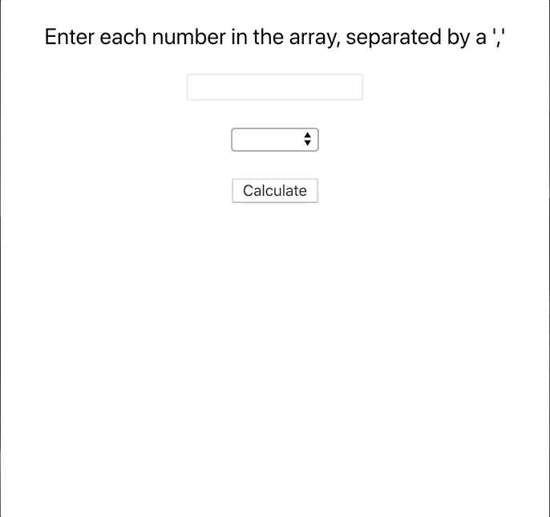

# React Forms Lab

## Functionality

Build a React app containing:

- An input where the user can enter comma-separated number values in an array
- A select to choose between calculating the sum, the average, and the [mode](https://www.mathsisfun.com/definitions/mode.html) (most frequently occurring number)
- A calculate button that, when pressed, puts the result of the selected operation on the input numbers on the screen
  - If the numbers are invalid for some reason, put `Invalid input.` (Notice the period at the end.)

For example, if the text input contains `1,3,3,7` and the select is set to `sum`, clicking the button should print `14` to the screen.
Switching the select to `mode` and clicking the button again would replace that with `3`.

| input | operation | result         |
| ----- | --------- | -------------- |
| 1     | average   | 1              |
| 1     | mode      | 1              |
| 1     | sum       | 1              |
| 1,3,5 | average   | 3              |
| 1,3,5 | mode      | 1              |
| 1,3,5 | sum       | 9              |
|       | \*        | Invalid input. |
| apple | \*        | Invalid input. |
| 1,pie | \*        | Invalid input. |

## Getting Started

- Fork this repo
- Clone the forked repository
- `cd` to the directory where you cloned it
- `npm install` to install dependencies
- `npm run cypress` to open the cypress testing window

> _Note_: Remember to `git add`, `git commit` and `git push` regularly

## Submission Guidelines

- When finished, commit and push your work.
- Make a pull request on github.
- Submit the link to your pull request on Canvas.

## Bonus

- Change the select input to show all three elements at once using `size`, and allow selecting `multiple`.
- When the button is pressed, print each selected operation onto the screen on a new line, like _`Sum: 35`_.
- Bonus hints:
  - [Select multiple example and documentation](https://www.w3schools.com/tags/att_select_multiple.asp)
  - In the `<select>` element's `onChange` callback, you can use `e.target.selectedOptions`. How can you get from a list of `selectedOptions` to a list of selected values?
  - In your component state, should the selected options be a string, an array, or some other data structure?
  - Should the result you compute be a number, a string, an array of strings, or some other data structure?
